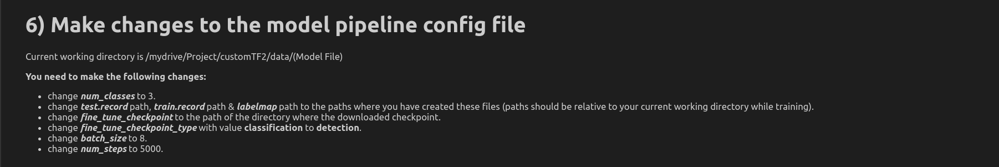

# Object-detection-tensorflow-api
Download the files and place the **Project** folder and the **notebook** in your Google drive. Follow the steps inside the **notebook** to train the desired pre-trained model.

